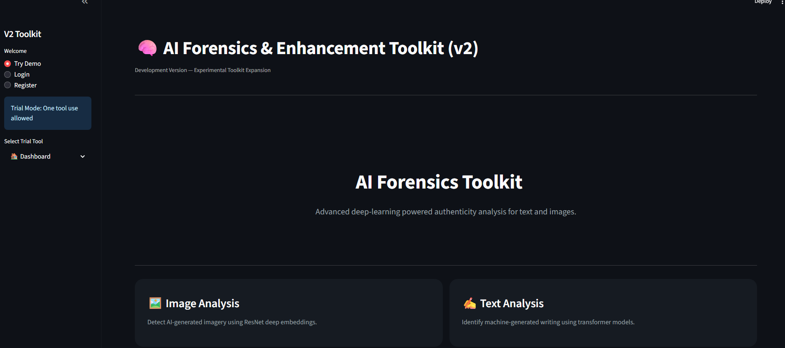
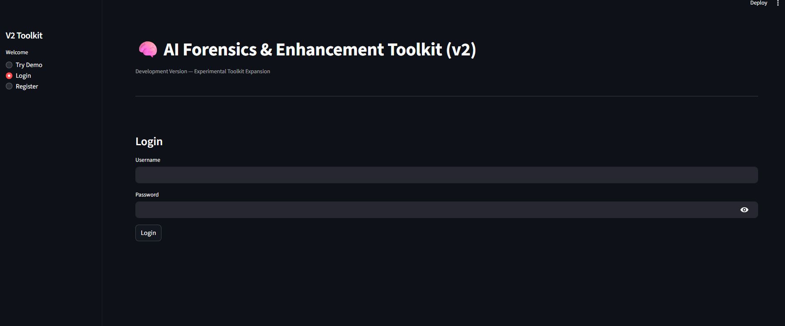
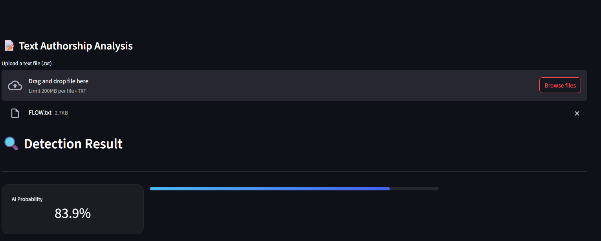
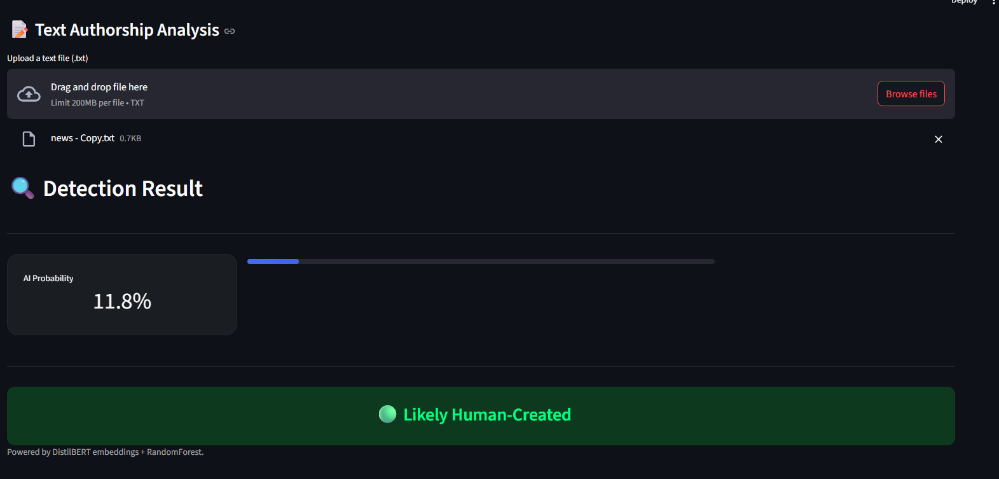
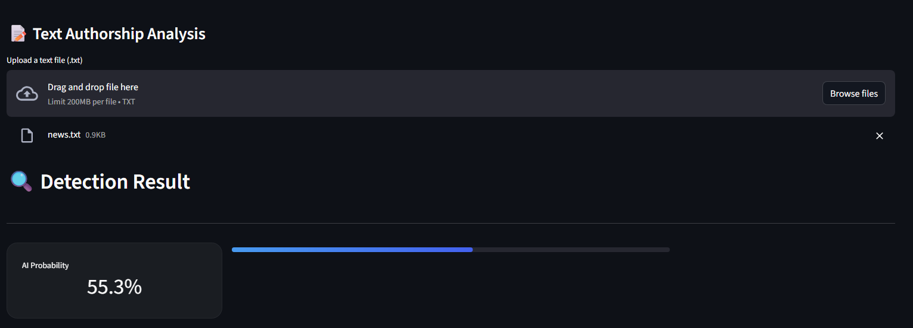
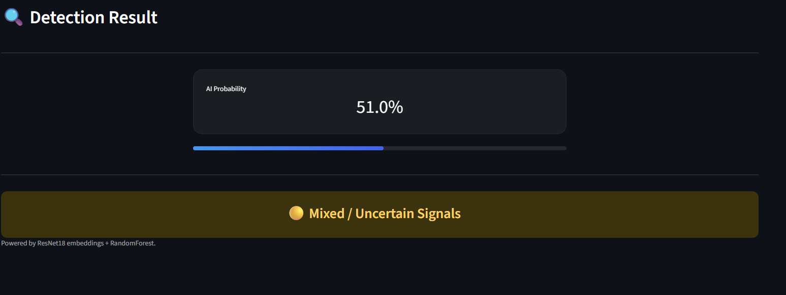
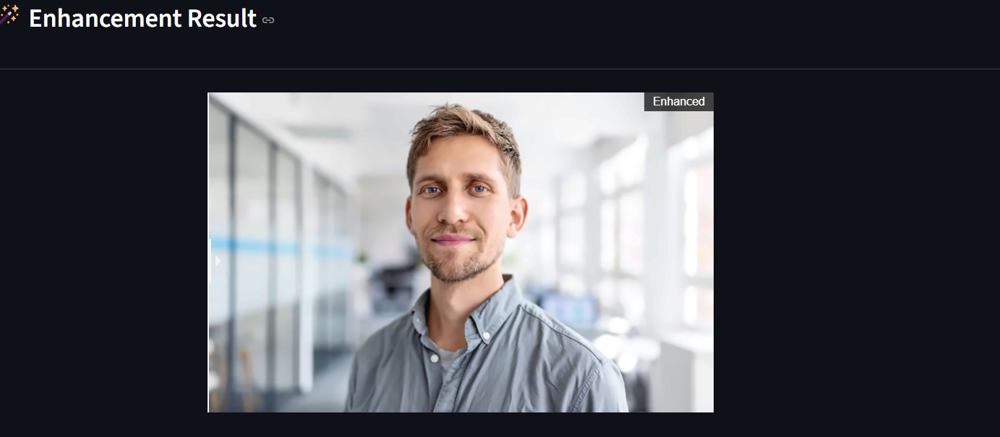
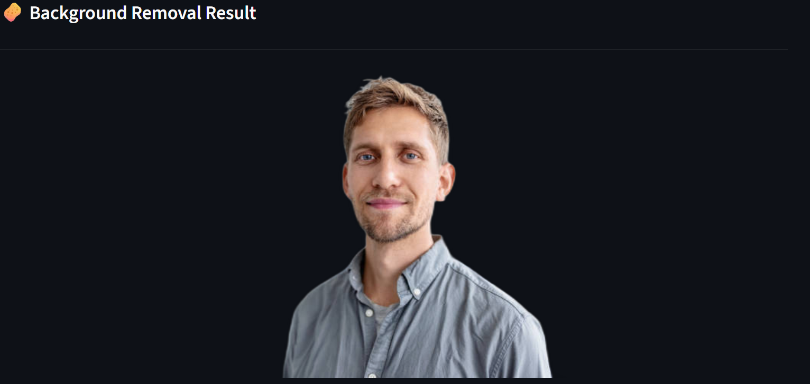

# 🧠 AI Forensics & Enhancement Toolkit (v2)

Advanced deep-learning powered authenticity analysis for text and images, with image enhancement and background removal utilities. Built with Streamlit, DistilBERT, ResNet18, and scikit-learn.

> Development Version — Experimental Toolkit Expansion

---

## Screenshots

### Dashboard



### Login & Registration



### AI Text Detector

| High AI Probability (83.9%) | Low AI Probability (11.8%) |
|---|---|
|  |  |

| Uncertain Result (55.3%) |
|---|
|  |

### AI Image Detector



### Image Enhancer



### Background Remover



---

## What It Does

Upload a `.txt` file or an image and the toolkit runs it through a deep-learning pipeline to determine whether it was AI-generated or human-created. The text detector uses DistilBERT transformer embeddings; the image detector uses ResNet18 visual features. Both output an AI probability score with conservative thresholds to avoid overconfident misclassification.

---

## Features

**AI Text Detection**
- 768-dimensional CLS embedding extracted from DistilBERT (`distilbert-base-uncased`)
- RandomForest classifier trained on 6,000 news samples (Fake/True dataset)
- Conservative thresholds: >85% → AI, <25% → Human, otherwise → Uncertain
- Minimum 30-word input enforced before inference

**AI Image Detection**
- 512-dimensional feature vector extracted from headless ResNet18 (ImageNet pretrained)
- RandomForest classifier trained on real vs AI-generated image dataset
- Same conservative threshold scheme as text detection

**Image Enhancer**
- 2× bicubic upscaling
- NLM denoising (mild, h=3)
- Unsharp mask sharpening
- Light contrast boost
- Before/after slider comparison with resolution and sharpness metrics

**Background Remover**
- Powered by `rembg` (U2Net segmentation model)
- Returns RGBA PNG with transparent background

**Authentication**
- SQLite user registration and login
- SHA-256 password hashing
- One-use demo trial mode — no login required for a single text detection

---

## System Architecture

```
User Upload (txt / image)
        │
        ▼
┌───────────────────────────┐
│     Feature Extraction     │
│                           │
│  Text → DistilBERT        │
│         768-dim CLS vec   │
│                           │
│  Image → ResNet18         │
│          512-dim vector   │
└────────────┬──────────────┘
             │
             ▼
┌───────────────────────────┐
│   RandomForest Classifier  │
│   .predict_proba()        │
│   → AI probability [0,1]  │
└────────────┬──────────────┘
             │
             ▼
┌───────────────────────────┐
│   Threshold Decision       │
│   >85%  → Likely AI       │
│   <25%  → Likely Human    │
│   else  → Uncertain       │
└────────────┬──────────────┘
             │
             ▼
       Streamlit UI
```

---

## File Structure

```
ai-forensics-toolkit/
├── app.py                       # Streamlit entrypoint + all page routing
├── auth.py                      # SQLite user auth (register / login)
│
├── modules/
│   ├── text_checker.py          # check_text_authenticity()
│   ├── image_checker.py         # check_image_authenticity()
│   ├── deep_text_features.py    # DistilBERT CLS embedding extractor
│   ├── deep_image_features.py   # ResNet18 512-dim feature extractor
│   ├── text_features.py         # Heuristic signals (diversity, uniformity)
│   ├── image_features.py        # Low-level signals (noise, FFT energy)
│   ├── verdict.py               # Randomised verdict language generator
│   ├── image_enhancer.py        # OpenCV enhancement pipeline
│   └── background_remover.py   # rembg wrapper
│
├── models/
│   ├── text_ai_detector_v2.pkl  # Trained text classifier
│   └── image_ai_detector.pkl   # Trained image classifier
│
├── data/
│   └── users.db                 # SQLite user DB (auto-created on launch)
│
├── train_text_model_v2.py       # Offline training — text model
└── train_image_model.py         # Offline training — image model
```

---

## Installation

### Prerequisites

- Python 3.10+
- Git

### Setup

```bash
# Clone
git clone https://github.com/your-username/ai-forensics-toolkit.git
cd ai-forensics-toolkit

# Install dependencies
pip install streamlit torch torchvision transformers scikit-learn joblib \
            rembg opencv-python pillow streamlit-image-comparison

# Place trained models
mkdir models
cp text_ai_detector_v2.pkl image_ai_detector.pkl models/

# Run
streamlit run app.py
```

The app is live at `http://localhost:8501`.  
On first launch `data/users.db` is auto-created. DistilBERT and ResNet18 weights are downloaded from HuggingFace on first inference if not cached locally (~270MB total).

---

## Training the Models

### Text Model

Expects `datasets/Fake.csv` and `datasets/True.csv` with a `text` column.  
Samples 3,000 per class, extracts DistilBERT embeddings for all 6,000 samples (~20–40 min on CPU), then trains a 200-tree RandomForest.

```bash
python train_text_model_v2.py
# Saves → models/text_ai_detector_v2.pkl
```

### Image Model

Expects `dataset/real/` and `dataset/ai/` folders containing images.  
Extracts ResNet18 features per image, trains a 200-tree RandomForest.

```bash
python train_image_model.py
# Saves → models/image_ai_detector.pkl
```

---

## Technology Stack

| Layer | Technology | Purpose |
|---|---|---|
| UI | Streamlit | Web interface, file upload, session state |
| Text Embeddings | DistilBERT (HuggingFace) | 768-dim CLS token vectors |
| Image Embeddings | ResNet18 (torchvision) | 512-dim feature vectors |
| Classifier | RandomForest (scikit-learn) | AI probability scoring |
| Image Processing | OpenCV | Enhancement pipeline |
| Background Removal | rembg (U2Net) | Segmentation-based BG removal |
| Auth | SQLite + hashlib | User registration and login |

---

## Known Limitations

- Text model trained on news-domain data. Performance on short-form, creative, or domain-specific writing may degrade.
- Image classifier accuracy depends entirely on the quality of your training dataset — not included in this repo.
- DistilBERT truncates at 256 tokens. Text beyond ~200 words is silently dropped.
- Background remover downloads ~170MB of U2Net weights on first use.
- Passwords are stored as plain SHA-256 (no salt). Use `bcrypt` or `argon2` before any public deployment.
- `image_features.py` and `text_features.py` heuristic signals are computed but not fed to the classifiers — they only power the verdict language generator.

---

## License

MIT

---

Built as a portfolio project demonstrating ML pipeline engineering, transformer feature extraction, and full-stack Python application development.
